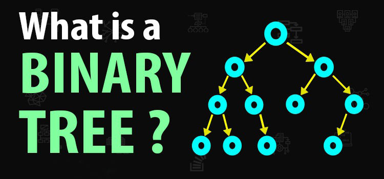

# Binary Trees

## Introduction

A binary tree is a tree data structure in which each node has at most two children, which are referred to as the left child and the right child.

A binary search tree is a binary tree in which every node fits a specific ordering property: all left descendents <= n < all right descendents. This must be true for each node n.

## Properties

- The maximum number of nodes at level `l` of a binary tree is `2^l`.
- Maximum number of nodes in a binary tree of height `h` is `2^(h+1) - 1`.
- In a binary tree with `n` nodes, minimum possible height or the minimum number of levels is `log2(n+1) - 1`.
- A binary tree with `l` leaves has at least `log2(l) + 1` levels.

## Types of Binary Trees

- **Full Binary Tree**: A binary tree is full if every node has 0 or 2 children.
- **Complete Binary Tree**: A binary tree is complete if all levels are completely filled except possibly for the last level and the last level has all keys as left as possible.
- **Perfect Binary Tree**: A binary tree is perfect if all internal nodes have two children and all leaves are at the same level.
- **Balanced Binary Tree**: A binary tree is balanced if the height of the tree is O(log n) where n is the number of nodes.

## Binary Tree Traversals

| Traversal | Order                 |
| --------- | --------------------- |
| Inorder   | Left -> Root -> Right |
| Preorder  | Root -> Left -> Right |
| Postorder | Left -> Right -> Root |

## Binary Tree Applications

- Binary search trees
- Huffman coding trees
- Binary tree sort
- Expression trees
- Syntax Tree
- Memory dump

## Operations

- **Insertion**: Adds an element to the tree
- **Deletion**: Removes an element from the tree
- **Search**: Searches an element in the tree
- **Traversal**: Visiting all the nodes of the tree

## Time Complexities

| Operation | Average  | Worst Case |
| --------- | -------- | ---------- |
| Space     | O(n)     | O(n)       |
| Search    | O(log n) | O(n)       |
| Insert    | O(log n) | O(n)       |
| Delete    | O(log n) | O(n)       |
